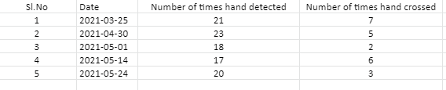

# Shredder-Machine-Accident-Prevention
Solving Problem of Accidents with Garbage Shredder Machine by Computer Vision. Look at Description for more details and DEMO.

## Demo:

## Problem Statement Example:

## File Structure to navigate easily:

## Results Stored as

## How to Run
#### 1. Create Virtual Environment(Python==3.6.9)
#### 2. Install Requirements(requirements.txt)

#### 3. run hand_detection.py

