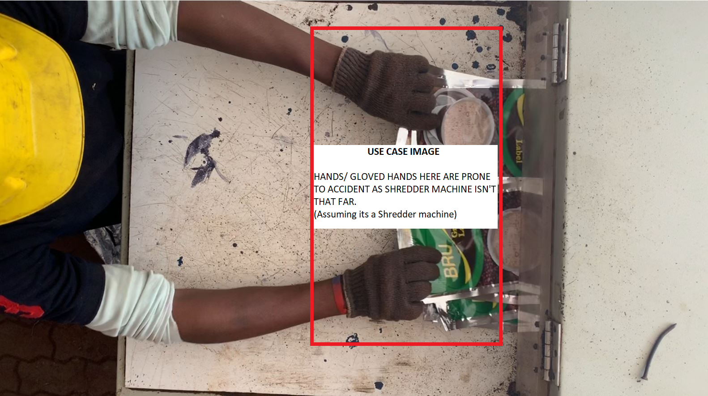
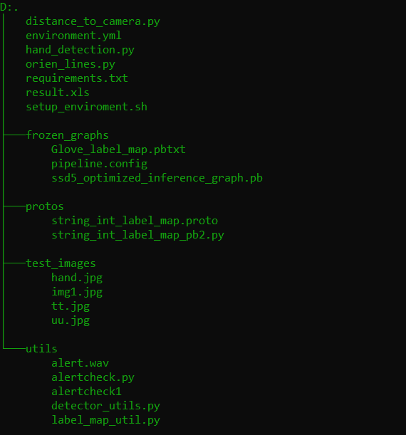

# Shredder-Machine-Accident-Prevention
Solving Problem of Accidents with Garbage Shredder Machine by Computer Vision. Look at Description for more details and examples.

## Demo:

## Problem Statement Example:

## File Structure to navigate easily:

## How to Run
1. Create Virtual Environment(Python==3.6.9)
2. Install Requirements(requirements.txt)
3. run hand_detection.py

